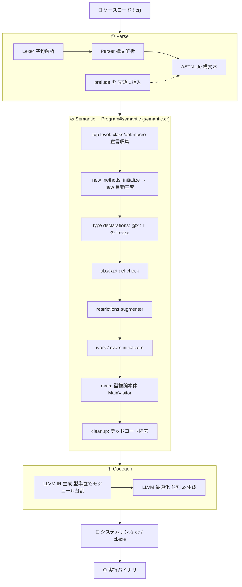
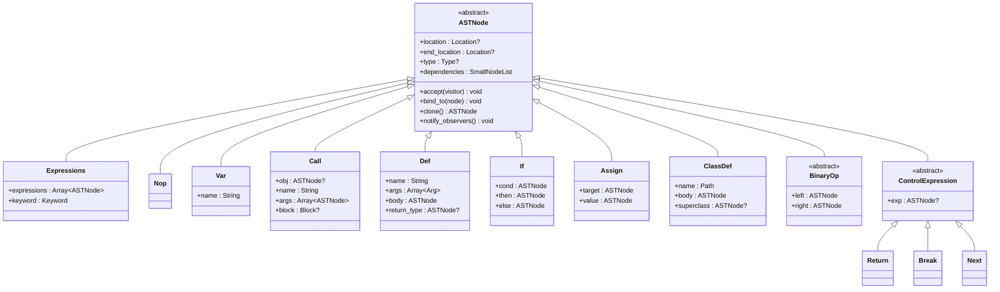
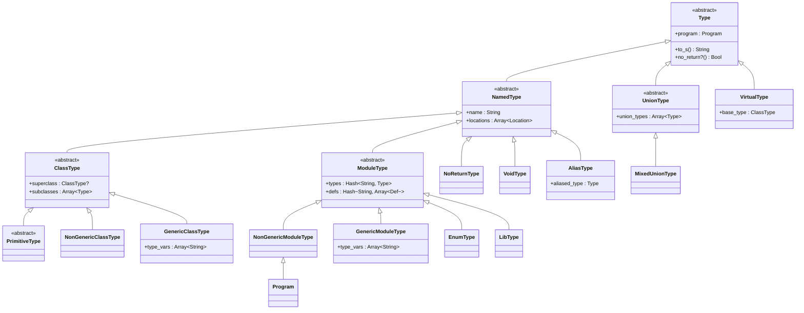
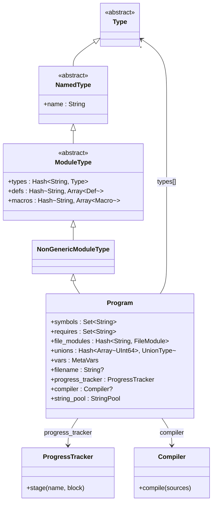
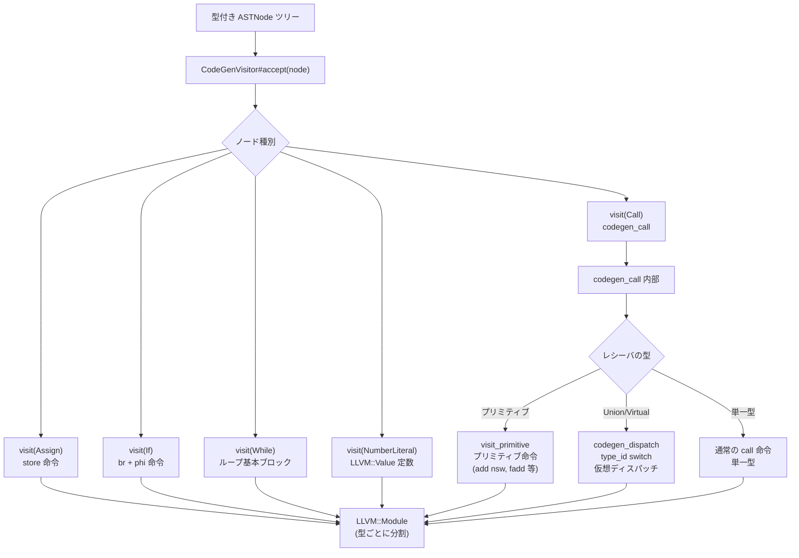

# Crystal コンパイラの仕組み

> **対象読者:** Crystal の型システムや一般的なコンパイラ理論（字句解析・構文解析・型推論・コード生成）を把握しており、Crystalコンパイラ本体に貢献したい開発者  
> **目的:** `src/compiler/crystal/` 配下のコードを自力で読み、変更を加えられるようになること

---

## 目次

1. [全体アーキテクチャ](#1-全体アーキテクチャ)
2. [ディレクトリ構造リファレンス](#2-ディレクトリ構造リファレンス)
3. [ASTノード体系](#3-astノード体系)
4. [型ヒエラルキー](#4-型ヒエラルキー)
5. [Crystal::Program — コンパイルの中央データベース](#5-crystalprogram--コンパイルの中央データベース)
6. [字句解析・構文解析](#6-字句解析構文解析)
7. [require システム](#7-require-システム)
8. [意味解析の全パス](#8-意味解析の全パス)
9. [型推論システム（核心）](#9-型推論システム核心)
10. [マクロシステム](#10-マクロシステム)
11. [LLVMコード生成](#11-llvmコード生成)
12. [コントリビュートガイド](#12-コントリビュートガイド)

---

## 1. 全体アーキテクチャ

Crystal コンパイラはコンパイラ自身が Crystal で書かれたセルフホスティングコンパイラである。コンパイルは大きく **①フロントエンド（パース）→ ②ミドルエンド（意味解析）→ ③バックエンド（コード生成）** の三層に分かれる。



フロントエンドのエントリポイントは [`src/compiler/crystal/compiler.cr`](https://github.com/crystal-lang/crystal/blob/master/src/compiler/crystal/compiler.cr) の `Crystal::Compiler` クラスである。`compile(sources)` メソッドがパース・意味解析・コード生成を順番に呼び出す。

```crystal
# compiler.cr — parse ステージの実装
private def parse(program, sources : Array)
  @progress_tracker.stage("Parse") do
    nodes = sources.map { |source| parse(program, source).as(ASTNode) }
    nodes = Expressions.from(nodes)
    location = Location.new(program.filename, 1, 1)
    # すべてのソースの先頭に `require "prelude"` を自動挿入する
    nodes = Expressions.new([Require.new(prelude).at(location), nodes] of ASTNode)
    program.normalize(nodes)
  end
end
```

**`--progress` フラグ（`CRYSTAL_PROGRESS=1` 環境変数）を付けると各ステージの経過時間が標準エラー出力に表示される。** パフォーマンス改善やボトルネック特定に有用。

---

## 2. ディレクトリ構造リファレンス

### `src/compiler/crystal/` — コンパイラ本体

| パス                                                                                                                  | 責務                                                                 |
| --------------------------------------------------------------------------------------------------------------------- | -------------------------------------------------------------------- |
| [`compiler.cr`](https://github.com/crystal-lang/crystal/blob/master/src/compiler/crystal/compiler.cr)                 | `Crystal::Compiler` クラス。コンパイル全体を統括する                 |
| [`program.cr`](https://github.com/crystal-lang/crystal/blob/master/src/compiler/crystal/program.cr)                   | `Crystal::Program` クラス。型・メソッド・requireキャッシュ等の中央DB |
| [`types.cr`](https://github.com/crystal-lang/crystal/blob/master/src/compiler/crystal/types.cr)                       | 型システム全定義（約3600行）。`Type` から始まる継承ツリー            |
| [`semantic.cr`](https://github.com/crystal-lang/crystal/blob/master/src/compiler/crystal/semantic.cr)                 | 意味解析の全パスを定義・呼び出す                                     |
| [`crystal_path.cr`](https://github.com/crystal-lang/crystal/blob/master/src/compiler/crystal/crystal_path.cr)         | `require` のファイルシステムパス解決                                 |
| [`formatter.cr`](https://github.com/crystal-lang/crystal/blob/master/src/compiler/crystal/formatter.cr)               | `crystal format` のコードフォーマッタ                                |
| [`progress_tracker.cr`](https://github.com/crystal-lang/crystal/blob/master/src/compiler/crystal/progress_tracker.cr) | コンパイルステージの進捗・時間計測                                   |

### `syntax/` — 字句解析・構文解析

| ファイル                                                                                                                    | 責務                                                    |
| --------------------------------------------------------------------------------------------------------------------------- | ------------------------------------------------------- |
| [`syntax/lexer.cr`](https://github.com/crystal-lang/crystal/blob/master/src/compiler/crystal/syntax/lexer.cr)               | 字句解析器（約2980行）。ソース文字列を `Token` 列へ変換 |
| [`syntax/token.cr`](https://github.com/crystal-lang/crystal/blob/master/src/compiler/crystal/syntax/token.cr)               | 全トークン種別・全キーワードの定義                      |
| [`syntax/parser.cr`](https://github.com/crystal-lang/crystal/blob/master/src/compiler/crystal/syntax/parser.cr)             | 再帰降下構文解析器（約6500行）。`Lexer` を継承          |
| [`syntax/ast.cr`](https://github.com/crystal-lang/crystal/blob/master/src/compiler/crystal/syntax/ast.cr)                   | 全ASTノードクラス（約2500行）                           |
| [`syntax/visitor.cr`](https://github.com/crystal-lang/crystal/blob/master/src/compiler/crystal/syntax/visitor.cr)           | Visitorパターン基底クラス                               |
| [`syntax/transformer.cr`](https://github.com/crystal-lang/crystal/blob/master/src/compiler/crystal/syntax/transformer.cr)   | 木を新しい木に変換する Transformer 基底クラス           |
| [`syntax/location.cr`](https://github.com/crystal-lang/crystal/blob/master/src/compiler/crystal/syntax/location.cr)         | ソース位置（ファイル名・行・列）の値オブジェクト        |
| [`syntax/to_s.cr`](https://github.com/crystal-lang/crystal/blob/master/src/compiler/crystal/syntax/to_s.cr)                 | ASTノードを Crystal ソースコード文字列に戻す            |
| [`syntax/virtual_file.cr`](https://github.com/crystal-lang/crystal/blob/master/src/compiler/crystal/syntax/virtual_file.cr) | マクロ展開後の仮想ソースファイル管理                    |

### `semantic/` — 意味解析

| ファイル                                                                                                                                                    | 責務                                                         |
| ----------------------------------------------------------------------------------------------------------------------------------------------------------- | ------------------------------------------------------------ |
| [`semantic/top_level_visitor.cr`](https://github.com/crystal-lang/crystal/blob/master/src/compiler/crystal/semantic/top_level_visitor.cr)                   | 第1パス: class/module/def/macro の宣言処理                   |
| [`semantic/main_visitor.cr`](https://github.com/crystal-lang/crystal/blob/master/src/compiler/crystal/semantic/main_visitor.cr)                             | メインパス: 型推論の本体（約3700行）                         |
| [`semantic/semantic_visitor.cr`](https://github.com/crystal-lang/crystal/blob/master/src/compiler/crystal/semantic/semantic_visitor.cr)                     | 上記2つの共通基底クラス。`require` 処理を担う                |
| [`semantic/bindings.cr`](https://github.com/crystal-lang/crystal/blob/master/src/compiler/crystal/semantic/bindings.cr)                                     | ASTノードの型依存グラフ。`SmallNodeList` で observers を管理 |
| [`semantic/call.cr`](https://github.com/crystal-lang/crystal/blob/master/src/compiler/crystal/semantic/call.cr)                                             | `Call#recalculate` — 呼び出し型推論の核心                    |
| [`semantic/method_lookup.cr`](https://github.com/crystal-lang/crystal/blob/master/src/compiler/crystal/semantic/method_lookup.cr)                           | オーバーロード解決                                           |
| [`semantic/type_merge.cr`](https://github.com/crystal-lang/crystal/blob/master/src/compiler/crystal/semantic/type_merge.cr)                                 | 複数型の Union 合成アルゴリズム                              |
| [`semantic/restrictions.cr`](https://github.com/crystal-lang/crystal/blob/master/src/compiler/crystal/semantic/restrictions.cr)                             | `def foo(x : Int32)` のような型制約の評価                    |
| [`semantic/filters.cr`](https://github.com/crystal-lang/crystal/blob/master/src/compiler/crystal/semantic/filters.cr)                                       | `is_a?` や `nil?` による制御フロー型絞り込み                 |
| [`semantic/cleanup_transformer.cr`](https://github.com/crystal-lang/crystal/blob/master/src/compiler/crystal/semantic/cleanup_transformer.cr)               | デッドコード除去・AST後処理                                  |
| [`semantic/type_declaration_processor.cr`](https://github.com/crystal-lang/crystal/blob/master/src/compiler/crystal/semantic/type_declaration_processor.cr) | `@x : Int32` 型宣言の処理                                    |
| [`semantic/abstract_def_checker.cr`](https://github.com/crystal-lang/crystal/blob/master/src/compiler/crystal/semantic/abstract_def_checker.cr)             | abstract メソッドの実装確認                                  |
| [`semantic/recursive_struct_checker.cr`](https://github.com/crystal-lang/crystal/blob/master/src/compiler/crystal/semantic/recursive_struct_checker.cr)     | 再帰的 struct の検出（コード生成不可のため必要）             |
| [`semantic/literal_expander.cr`](https://github.com/crystal-lang/crystal/blob/master/src/compiler/crystal/semantic/literal_expander.cr)                     | `[1, 2, 3]` 等のリテラルをメソッド呼び出しに展開             |
| [`semantic/exhaustiveness_checker.cr`](https://github.com/crystal-lang/crystal/blob/master/src/compiler/crystal/semantic/exhaustiveness_checker.cr)         | `case/in` の網羅性チェック                                   |

### `codegen/` — LLVMコード生成

| ファイル                                                                                                                  | 責務                                              |
| ------------------------------------------------------------------------------------------------------------------------- | ------------------------------------------------- |
| [`codegen/codegen.cr`](https://github.com/crystal-lang/crystal/blob/master/src/compiler/crystal/codegen/codegen.cr)       | `CodeGenVisitor` の定義（約2630行）               |
| [`codegen/llvm_typer.cr`](https://github.com/crystal-lang/crystal/blob/master/src/compiler/crystal/codegen/llvm_typer.cr) | Crystal型 → LLVM型 の変換テーブル                 |
| [`codegen/llvm_id.cr`](https://github.com/crystal-lang/crystal/blob/master/src/compiler/crystal/codegen/llvm_id.cr)       | 各型への `type_id` 整数の割り当て                 |
| [`codegen/call.cr`](https://github.com/crystal-lang/crystal/blob/master/src/compiler/crystal/codegen/call.cr)             | メソッド呼び出しの LLVM IR 生成                   |
| [`codegen/primitives.cr`](https://github.com/crystal-lang/crystal/blob/master/src/compiler/crystal/codegen/primitives.cr) | 整数演算等のプリミティブを直接 LLVM 命令に変換    |
| [`codegen/unions.cr`](https://github.com/crystal-lang/crystal/blob/master/src/compiler/crystal/codegen/unions.cr)         | Union 型のタグ付き共用体のメモリレイアウト生成    |
| [`codegen/cast.cr`](https://github.com/crystal-lang/crystal/blob/master/src/compiler/crystal/codegen/cast.cr)             | 型キャスト命令の生成                              |
| [`codegen/debug.cr`](https://github.com/crystal-lang/crystal/blob/master/src/compiler/crystal/codegen/debug.cr)           | DWARF デバッグ情報の生成                          |
| [`codegen/exception.cr`](https://github.com/crystal-lang/crystal/blob/master/src/compiler/crystal/codegen/exception.cr)   | `rescue/ensure` の LLVM 実装（landingpad）        |
| [`codegen/target.cr`](https://github.com/crystal-lang/crystal/blob/master/src/compiler/crystal/codegen/target.cr)         | ターゲットアーキテクチャ・OS の設定               |
| [`codegen/abi/`](https://github.com/crystal-lang/crystal/blob/master/src/compiler/crystal/codegen/abi/)                   | ABI 実装: `x86_64`, `aarch64`, `arm`, `wasm32` 等 |

### `macros/` — マクロシステム

| ファイル                                                                                                                  | 責務                                                  |
| ------------------------------------------------------------------------------------------------------------------------- | ----------------------------------------------------- |
| [`macros/interpreter.cr`](https://github.com/crystal-lang/crystal/blob/master/src/compiler/crystal/macros/interpreter.cr) | `MacroInterpreter < Visitor` — マクロコードの解釈実行 |
| [`macros/macros.cr`](https://github.com/crystal-lang/crystal/blob/master/src/compiler/crystal/macros/macros.cr)           | マクロ展開のコアロジック                              |
| [`macros/methods.cr`](https://github.com/crystal-lang/crystal/blob/master/src/compiler/crystal/macros/methods.cr)         | マクロ内メソッド（`.stringify`, `.instance_vars` 等） |
| [`macros/types.cr`](https://github.com/crystal-lang/crystal/blob/master/src/compiler/crystal/macros/types.cr)             | マクロ内での型情報へのアクセス                        |

---

## 3. ASTノード体系

### `Crystal::ASTNode` — 全ノードの基底

[`syntax/ast.cr`](https://github.com/crystal-lang/crystal/blob/master/src/compiler/crystal/syntax/ast.cr) に定義。全 ASTノードが継承する抽象クラス。

```crystal
abstract class ASTNode
  property location : Location?       # ノード開始位置
  property end_location : Location?   # ノード終了位置

  def clone   # ディープコピー（マクロ展開時に多用）
    clone = clone_without_location
    clone.location = location
    clone.end_location = end_location
    clone.doc = doc
    clone
  end
end
```

意味解析後には [`semantic/bindings.cr`](https://github.com/crystal-lang/crystal/blob/master/src/compiler/crystal/semantic/bindings.cr) で以下が追加される:

```crystal
class ASTNode
  getter dependencies : SmallNodeList = SmallNodeList.new  # 依存ノード
  # @observers は private; add_observer/notify_observers 経由でアクセス
  @type : Type?  # セマンティック解析後に設定される型
end
```

### ASTNode クラス図



### Visitor と Transformer

**`Visitor`**（[`syntax/visitor.cr`](https://github.com/crystal-lang/crystal/blob/master/src/compiler/crystal/syntax/visitor.cr)）は読み取り専用の木の巡回パターン。`visit(node : NodeType)` を実装してノードを処理する。意味解析の各パスは原則として `Visitor` を継承する。

**`Transformer`**（[`syntax/transformer.cr`](https://github.com/crystal-lang/crystal/blob/master/src/compiler/crystal/syntax/transformer.cr)）は各ノードを変換した新ノードを返すパターン。`transform(node : NodeType)` がノードを受け取り変換後のノードを返す。`CleanupTransformer` 等がこれを利用する。


### ASTNode の二重性

`ASTNode` は**構文ノード**と**型情報ノード**の二つの役割を同時に担うが、これらは時系列的に分離している。

```
パース後 (型なし状態):
  ASTNode
  ├── location, end_location  # ソース位置（Lexer が付与）
  ├── @type = nil             # まだ型がない
  └── @dependencies = []     # まだ依存グラフが空

意味解析後 (型付き状態):
  ASTNode
  ├── location, end_location
  ├── @type = Int32           # MainVisitor が設定
  ├── @dependencies = [...]   # bind_to で構築された依存グラフ
  └── @observers = [...]      # このノードの型変化を監視するノード群
```

### `Expressions` の特殊な役割

[`syntax/ast.cr`](https://github.com/crystal-lang/crystal/blob/master/src/compiler/crystal/syntax/ast.cr) の `Expressions` は Crystal 構文の「文のリスト（ブロック）」を表す唯一のノードで、他のほぼ全ノードの根幹をなす。

```crystal
class Expressions < ASTNode
  enum Keyword
    None   # 通常の式の列
    Paren  # `(a; b)` のような括弧付き
    Begin  # `begin ... end`
  end

  property expressions : Array(ASTNode)
  property keyword : Keyword = Keyword::None
```

**`Expressions.from` ファクトリメソッド** は Crystal コンパイラ内で非常に多用される:

```crystal
# 配列が空 → Nop.new（何もしないノード）
# 配列が1要素 → その要素を直接返す（Expressions で包まない！）
# 配列が2要素以上 → Expressions.new
def self.from(obj : Array)
  case obj.size
  when 0 then Nop.new
  when 1 then obj.first
  else        new obj
  end
end
```

この挙動が重要な理由: `require` が展開された後の AST において、`Expressions.from` は単一ファイルの場合に不要なラッパーを作らない。パフォーマンスと後続 Visitor の処理を簡潔にするための設計である。

### `MainVisitor#visit(node : Expressions)` の処理

`Expressions` の visit では**最後の式だけが型を持ち、それ以外は副作用のためだけに評価される**:

```crystal
def visit(node : Expressions)
  exp_count = node.expressions.size
  node.expressions.each_with_index do |exp, i|
    if i == exp_count - 1
      exp.accept self          # 最後の式: bind_to して型を伝播
      node.bind_to exp
    else
      ignoring_type_filters { exp.accept self }  # 中間の式: 型フィルタを無視して評価
    end
  end

  if node.empty?
    node.set_type(@program.nil)  # 空の Expressions は nil 型
  end
  false
end
```

`ignoring_type_filters` は `is_a?` 等の型絞り込みの副作用を途中の式に残さないための機構である。

### `FileNode` — ファイルの境界ノード

`require` が展開されたとき、`Expressions` の中に `FileNode` が挿入される。`FileNode` はファイル名を保持し、`MainVisitor` が visit したとき **`@vars` と `@meta_vars` をファイルローカルなものに切り替える**:

```crystal
def visit(node : FileNode)
  old_vars = @vars
  old_meta_vars = @meta_vars
  old_file_module = @file_module

  @vars = MetaVars.new
  @file_module = file_module = @program.file_module(node.filename)
  @meta_vars = file_module.vars          # ファイルローカルなメタ変数辞書

  node.node.accept self                  # ファイル内容を visit

  @vars = old_vars                       # 呼び出し元の変数スコープに戻す
  @meta_vars = old_meta_vars
  @file_module = old_file_module
  false
end
```

これにより、各ファイルのトップレベル変数が他のファイルに漏れない。`program.file_module(filename)` が `Program#file_modules` ハッシュを引くことで、同一ファイルが複数回 visit されても同一の `FileModule` を再利用できる。

### 主要な ASTNode サブクラスのカテゴリ

| カテゴリ       | 代表的なノード                                                   | 特徴                                                            |
| -------------- | ---------------------------------------------------------------- | --------------------------------------------------------------- |
| **リテラル**   | `NumberLiteral`, `StringLiteral`, `BoolLiteral`, `SymbolLiteral` | パース後に即座に型が確定。`set_type` で固定                     |
| **参照**       | `Var`, `InstanceVar`, `ClassVar`, `Global`, `Path`               | `bind_to` で型を依存グラフに組み込む                            |
| **呼び出し**   | `Call`                                                           | `recalculate` が observer 機構で繰り返し型推論する              |
| **制御フロー** | `If`, `While`, `Return`, `Yield`, `Block`                        | 複数の子ノードの型をマージして自身の型を決定                    |
| **宣言**       | `Def`, `ClassDef`, `ModuleDef`, `MacroDef`                       | 型を返さない（`Nil` 型を設定）。副作用で `Program` を変異させる |
| **型注釈**     | `TypeDeclaration`, `UninitializedVar`                            | `freeze_type` を設定して変数の型を固定                          |
| **変換**       | `Cast (as)`, `IsA (is_a?)`, `NilableCast (as?)`                  | 型フィルタの生成と型変換ノード                                  |


### 基本的な呼び出し契約

[`syntax/visitor.cr`](https://github.com/crystal-lang/crystal/blob/master/src/compiler/crystal/syntax/visitor.cr) で定義されるプロトコルを実際のコードで示す:

```crystal
class Visitor
  def visit_any(node) = true   # 全ノード共通の前処理フック（デフォルト: continue）
  def end_visit(node) = nil    # 後処理フック（デフォルト: no-op）
end

class ASTNode
  def accept(visitor)
    if visitor.visit_any self       # ① フック。false を返すと以下をすべてスキップ
      if visitor.visit self         # ② このノード固有の visit。false を返すと子をスキップ
        accept_children visitor     # ③ 子ノードを再帰的に accept
      end
      visitor.end_visit self        # ④ 後処理
    end
  end

  def accept_children(visitor)
    # ASTNode のデフォルト実装は空（子なし）
    # サブクラスごとに子ノードを列挙してオーバーライドされる
  end
end
```

これにより `visit` が `false` を返すと**子ノードの走査を止められる**。意味解析のほとんどの `visit` メソッドは自分で子を `accept` した後に `false` を返し、デフォルトの `accept_children` による二重走査を防ぐ。

例えば `Expressions` の accept_children:

```crystal
class Expressions < ASTNode
  def accept_children(visitor)
    @expressions.each &.accept(visitor)
  end
end
```

`Def` 等の宣言ノードは `TopLevelVisitor` での処理において `false` を返して本体（`body`）の走査を止める。本体が走査されるのは `MainVisitor` フェーズのみである。

### `visit_any` による横断的処理

`MainVisitor#visit_any`:

```crystal
def visit_any(node)
  @unreachable = false   # どのノードに入っても unreachable フラグをリセット
  super
end
```

`@unreachable` は `NoReturn` 型の式（`raise`, `return` 等）に出会った後に `true` になり、以降の式の型推論をスキップするために使われる。`visit_any` でリセットすることで、各ノードの入口で常にフレッシュな状態から始められる。

### Transformer の走査

`Transformer` は `Visitor` とは独立した走査機構を持つ。`ASTNode#transform(transformer)` が自身を変換して新ノードを返す:

```crystal
class ASTNode
  def transform(transformer)
    if transformer.transform_any self    # ① 変換前フック
      new_node = transformer.transform self  # ② 変換（自分自身または新ノードを返す）
      new_node.transform_children transformer  # ③ 子を再帰的に変換
      new_node
    else
      self
    end
  end
end
```

`CleanupTransformer` での実例: `If` ノードが常に then 節しか実行されないと判明した場合（else 節が `NoReturn`）、`If` ノードを `then` の内容に置き換えて返す。

---

## 4. 型ヒエラルキー

[`types.cr`](https://github.com/crystal-lang/crystal/blob/master/src/compiler/crystal/types.cr)（約3600行）が型システム全体を実装する。精選した継承ツリー:

```
Type (abstract)
├── NoReturnType            # 決して値を持たない式の型 (raise, exit 等)
├── VoidType                # C の void 相当
├── NilType                 # nil の型
├── BoolType
├── IntegerType
│   ├── Int8Type, Int16Type, Int32Type, Int64Type, Int128Type
│   └── UInt8Type, UInt16Type, UInt32Type, UInt64Type, UInt128Type
├── FloatType
│   ├── Float32Type
│   └── Float64Type
├── NamedType               # 名前を持つ型の基底
│   ├── ModuleType
│   │   ├── NonGenericModuleType   ← Program はここから継承
│   │   └── GenericModuleType      (例: Comparable(T))
│   ├── ClassType
│   │   ├── NonGenericClassType    (例: String, IO)
│   │   └── GenericClassType       (例: Array(T), Hash(K,V))
│   ├── StructType
│   │   ├── NonGenericStructType
│   │   └── GenericStructType      (例: Tuple(T*))
│   ├── EnumType
│   ├── LibType                    # `lib Foo` ブロック
│   └── AliasType                  # `alias Foo = Bar`
├── UnionType               # A | B。Program#unions でキャッシュ管理
├── PointerInstanceType     # Pointer(T) のインスタンス側
├── ProcInstanceType        # Proc(A, B, R) のインスタンス側
└── VirtualType             # abstract class の仮想ディスパッチ型
```

### Type クラス図



**`VirtualType`** は特に重要である。`abstract class Animal` を継承した `Dog`, `Cat` が存在するとき、`Animal` 型として扱われる変数の実体は `VirtualType(Animal)` になる。コード生成時にはタグ付き共用体（Union 型と同様の手法）として LLVM IR に変換され、仮想ディスパッチを実現する。

> **📊 他言語との比較: Union 型と Nil 安全**
>
> **Union 型の実装:**
>
> | 言語 | モデル | ランタイム表現 | 安全性 |
> |---|---|---|---|
> | **Crystal** | フラット Union（`A \| B \| C`、同一構成は singleton） | `{type_id: i32, data: union}` タグ付き共用体 | ◎ コンパイル時に全ケース検査 |
> | Rust | 代数的データ型（`enum`、名前付き variant） | タグ付き共用体（variant ごとにサイズ最大に揃える） | ◎ `match` で全網羅必須 |
> | TypeScript | 構造的 Union（`A \| B`） | ランタイムタグなし（duck typing） | △ 型ガード頼み |
> | Haskell | ADT（`data Either a b = Left a \| Right b`） | ヒープ上のタグ付きポインタ | ◎ 全 case 網羅必須 |
> | C | `union`（タグなし） | 生のメモリ共用 | ✗ 手動管理、unsafe |
>
> **Nil 安全の実装:**
>
> | 言語 | モデル | 記法 | Nil の本質 |
> |---|---|---|---|
> | **Crystal** | `Nil` はただの型（`String \| Nil`） | `String?` は糖衣構文 | Union 型と統一された概念 |
> | Rust | `Option<T>`（`Some(T) \| None`） | `Option<String>` | ADT の特殊ケース |
> | Swift | `Optional<T>` | `String?` | ADT の特殊ケース |
> | Kotlin | nullable 型（`String?`） | `String?` | 型システムに別軸として組み込み |
> | Java（〜10） | `null`（全参照型に存在） | なし | 型システム外（unsafe） |
>
> Crystal における `Nil` の最大の特徴は、**他言語のような特別扱いが一切ない**点にある。`String?` は `String | Nil` の構文糖衣に過ぎず、`Nil` は `NilType` という通常の型クラスである。Union 型の仕組みがそのまま Nil 安全を提供するため、`Option<T>` のようなラッパー型を別途用意する必要がない。

---

## 5. Crystal::Program — コンパイルの中央データベース

[`program.cr`](https://github.com/crystal-lang/crystal/blob/master/src/compiler/crystal/program.cr) の `Crystal::Program` は `NonGenericModuleType` を継承しており、コンパイル全体に関わるすべてのグローバルな状態を保持する。

```crystal
class Program < NonGenericModuleType
  # プログラム中に現れる全シンボル (:foo, :bar 等)
  getter symbols = Set(String).new

  # ファイルローカルな def とトップレベル変数の格納先
  # キーはファイルの絶対パス
  getter file_modules = {} of String => FileModule

  # require 済みファイルを記録して重複 require を防止
  getter requires = Set(String).new

  # Union型のキャッシュ。Union の構成型（のopaque id の配列）をキーとする
  # これにより `Int32 | String` と `String | Int32` は同一オブジェクトになる

  # トップレベル変数（main ファイルのみ）
  getter vars = MetaVars.new

  # スプラット展開の再帰チェック用
  getter splat_expansions : Hash(Def, Array(Type))
end
```

### Program クラス図



`Program` はトップレベルのモジュール型でもあるため、`Int32`, `String` 等の組み込み型はすべて `Program` に属する `NamedType` として格納されている。型を検索するには `program.types["String"]` のようにアクセスする。

---

## 6. 字句解析・構文解析

### Lexer — 字句解析器

[`syntax/lexer.cr`](https://github.com/crystal-lang/crystal/blob/master/src/compiler/crystal/syntax/lexer.cr) の `Crystal::Lexer` は `Char::Reader` でソース文字列を Unicode 単位で走査し、`Token` オブジェクト列を生成する。**Parser が直接 `next_token` を呼んで都度トークンを要求するプルモデル**であるため、トークン列は一括で生成されない。

重要な状態フラグ:

| フラグ                    | 意味                                                      |
| ------------------------- | --------------------------------------------------------- |
| `slash_is_regex`          | `/` を除算ではなく正規表現リテラルの開始として解析する    |
| `doc_enabled`             | `#` で始まるドキュメントコメントを `Token#doc` に保存する |
| `wants_def_or_macro_name` | `def`・`macro` の直後で予約語も名前として受け入れる       |

### Parser — 再帰降下構文解析器

[`syntax/parser.cr`](https://github.com/crystal-lang/crystal/blob/master/src/compiler/crystal/syntax/parser.cr) の `Crystal::Parser` は `Lexer` を直接継承し、メソッド呼び出しでトークンを消費する古典的な再帰降下パーサである（約6500行）。

```crystal
class Parser < Lexer
  enum ParseMode
    Normal
    Lib             # `lib Foo` ブロック内
    LibStructOrUnion
    Enum
  end
```

**変数スコープ管理が識別子/呼び出し判定の核心である。** `@var_scopes : Array(Set(String))` が変数名の集合をスタックとして保持する。パーサが識別子を読んだとき、それが現在スコープの変数名集合に含まれていれば「変数参照」、含まれていなければ「引数なしメソッド呼び出し」として解析される。

```
foo   # @var_scopes に "foo" が存在する → Var.new("foo")
foo   # @var_scopes に "foo" が存在しない → Call.new(nil, "foo", [])
```

エントリポイントは `parse` → `parse_expressions` → 各 `parse_XXX` メソッドと連鎖する。構文解析結果は `ASTNode` のツリーとして返される。

> **📊 他言語との比較: Lexer/Parser 実装方式**
>
> | 言語 | Lexer | Parser | 特記事項 |
> |---|---|---|---|
> | **Crystal** | 手書き DFA (`case current_char`) | 手書き再帰降下 | `@var_scopes` スタックで文脈依存判断 |
> | Rust | 手書き DFA | 手書き再帰降下 | 型文脈（`<` の曖昧性）を前後参照で解消 |
> | Go | 手書き DFA | 手書き再帰降下 | 文法がシンプルなため文脈依存ほぼ不要 |
> | Clang | 手書き DFA | 手書き再帰降下 | C/C++ の文脈依存構文をスコープ解析で解消 |
> | Ruby (〜3.1) | flex（字句生成器） | Yacc/Bison（LR(1)） | 宣言的文法だがエラーメッセージが難解 |
> | Ruby (3.2〜) | 手書き | LRAMA（LR、独自実装） | Yacc から独自 LR ジェネレータへ移行 |
> | Python (3.9〜) | 手書き | PEG/Packrat（pegen） | バックトラックを Packrat でメモ化 |
> | GHC (Haskell) | Alex（flex 系） | Happy（LALR） | 記号型言語の曖昧性を文法レベルで管理 |
>
> Crystal が手書き再帰降下を選んだ本質的理由は**文脈依存**にある。`foo` が変数かメソッド呼び出しかは `@var_scopes` を参照しないと決定できず、`{` がブロックか Hash リテラルかは呼び出し文脈によって変わる。これらは LR や PEG の宣言的文法では自然に表現しにくく、手書きコードの方が `ParseMode` enum や `@stop_on_do` フラグを使って直接制御できる。「本番利用されるコンパイラは手書き再帰降下に収束する」という現代の潮流はこの文脈依存性の困難さを反映している。

---

## 7. require システム

### ファイル検索: `CrystalPath`

[`crystal_path.cr`](https://github.com/crystal-lang/crystal/blob/master/src/compiler/crystal/crystal_path.cr) の `Crystal::CrystalPath` が `require "foo"` の解決を担う。

検索パスの優先順位:

1. **`CRYSTAL_PATH` 環境変数** — `:` 区切りのディレクトリリスト
2. **`Crystal::Config.path`** — コンパイラバイナリにビルド時に埋め込まれたパス  
3. **`lib/`** — shards がインストールしたライブラリ

**`$ORIGIN` 展開:** インストール可搬性のため `$ORIGIN` という特殊インディレクタが使われ、コンパイラバイナリのディレクトリからの相対パスとして標準ライブラリを参照する。

`require "./foo"` は現在ファイルからの相対パスとして解決される。`require "foo"` はパス検索を行う。

### require の重複防止

[`semantic/semantic_visitor.cr`](https://github.com/crystal-lang/crystal/blob/master/src/compiler/crystal/semantic/semantic_visitor.cr) の `visit(node : Require)` が処理する:

```crystal
def visit(node : Require)
  filenames = @program.find_in_path(node.string, relative_to_filename)

  @program.run_requires(node, filenames) do |filename|
    # Program#requires に追加済みなら skip（Set で O(1) 判定）
    next if @program.requires.includes?(filename)

    @program.requires << filename
    # ファイルをその場でパース → ASTNode に展開
    nodes << require_file(node, filename)
  end
end
```

`Program#requires` は `Set(String)`（絶対パスのセット）であり、同一ファイルを複数回 require しても1回だけ処理される。

### prelude のブートストラップ

`Compiler#parse` は全ソースの先頭に `Require.new("prelude")` ノードを挿入する。`prelude` は [`src/prelude.cr`](https://github.com/crystal-lang/crystal/blob/master/src/prelude.cr) を指し、そこから `object.cr`, `value.cr`, `int.cr`, `string.cr`, `array.cr` 等が連鎖的に require され、Crystal の全組み込み型が定義される。

---

## 8. 意味解析の全パス

[`semantic.cr`](https://github.com/crystal-lang/crystal/blob/master/src/compiler/crystal/semantic.cr) に定義される `Program#semantic` が全パスを順番に実行する。各ステージは `@progress_tracker.stage("Semantic (xxx)") { ... }` でラップされている。

```crystal
def semantic(node : ASTNode, cleanup = true, ...) : ASTNode
  node, processor = top_level_semantic(node)         # パス 1〜5

  # パス 6: インスタンス変数初期化子 (@x = 1)
  @progress_tracker.stage("Semantic (ivars initializers)") { ... }

  # パス 7: クラス変数初期化子 (@@x = 1)
  @progress_tracker.stage("Semantic (cvars initializers)") { ... }

  # パス 8: メインコード・型推論（最も重い）
  result = @progress_tracker.stage("Semantic (main)") do
    visit_main(node, ...)
  end

  # パス 9: デッドコード除去
  @progress_tracker.stage("Semantic (cleanup)") { cleanup_types; cleanup_files }

  # パス 10: 再帰的 struct の検出
  @progress_tracker.stage("Semantic (recursive struct check)") do
    RecursiveStructChecker.new(self).run
  end

  result
end
```

`top_level_semantic` が呼ぶ前半のパス:

```crystal
def top_level_semantic(node, ...)
  # パス 1: TopLevelVisitor — class/def/macro/alias/include 宣言の登録
  @progress_tracker.stage("Semantic (top level)") do
    node.accept TopLevelVisitor.new(self)
  end

  # パス 2: initialize → new の自動生成
  @progress_tracker.stage("Semantic (new)") do
    define_new_methods(new_expansions)
  end

  # パス 3: 型宣言処理 (@x : Int32 など)
  node, processor = @progress_tracker.stage("Semantic (type declarations)") do
    TypeDeclarationProcessor.new(self).process(node)
  end

  # パス 4: abstract def の実装確認
  @progress_tracker.stage("Semantic (abstract def check)") do
    AbstractDefChecker.new(self).run
  end

  # パス 5: 型制約オーグメンター（オーバーロード解決最適化）
  @progress_tracker.stage("Semantic (restrictions augmenter)") do
    node.accept RestrictionsAugmenter.new(self, new_expansions)
  end
end
```

### 各パスの責務詳細

| パス                   | クラス                           | 要点                                                                                      |
| ---------------------- | -------------------------------- | ----------------------------------------------------------------------------------------- |
| top level              | `TopLevelVisitor`                | クラス・モジュール・def・macro の **宣言** のみ処理。型のインスタンス化は行わない         |
| new                    | `define_new_methods`             | `initialize` のオーバーロードごとに `self.new(...)` を自動生成。これが `new` の実装の正体 |
| type declarations      | `TypeDeclarationProcessor`       | `@x : Int32` 等の明示的型宣言を収集し、型の freeze 化（`freeze_type`）を設定              |
| abstract def check     | `AbstractDefChecker`             | すべての具象クラスが abstract メソッドを実装しているか検査                                |
| restrictions augmenter | `RestrictionsAugmenter`          | オーバーロード候補に暗黙の型制約を付与してディスパッチを高速化                            |
| ivars initializers     | `InstanceVarsInitializerVisitor` | `@x = 1` のような初期化式を各クラスの型情報に紐付ける                                     |
| cvars initializers     | `ClassVarsInitializerVisitor`    | `@@x = 1` のグローバルな初期化順序を解決                                                  |
| main                   | `MainVisitor`                    | **型推論の本体**。すべての式に型を付与しメソッドをインスタンス化する（詳細は§7）          |
| cleanup                | `CleanupTransformer`             | 型推論後、`NoReturn` になった分岐の除去、単一型 Union の展開                              |
| recursive struct       | `RecursiveStructChecker`         | 無限サイズになる再帰的 struct を検出してエラー                                            |


### 全体の連鎖の全体図

```
Crystal::Compiler#compile
│
├─ parse(sources)
│   └─ Parser#parse → ASTNode
│       └─ Lexer#next_token（プルモデル）
│
└─ Program#semantic(node)
    │
    ├─ TopLevelVisitor.new.accept(node)         [パス1]
    │   └─ visit(ClassDef / ModuleDef / Def / Macro)
    │       ├─ Program#add_def / add_macro → @program.types を変異
    │       └─ MacroInterpreter（マクロ呼び出し時）
    │           └─ ExpandedMacro を再パース → 再度 TopLevelVisitor で visit
    │
    ├─ define_new_methods                        [パス2]
    │
    ├─ TypeDeclarationProcessor#process(node)   [パス3]
    │   └─ TypeDeclarationVisitor.accept(node)
    │
    ├─ AbstractDefChecker#run                   [パス4]
    │
    ├─ RestrictionsAugmenter.accept(node)        [パス5]
    │
    ├─ InstanceVarsInitializerVisitor.accept(node) [パス6]
    │   └─ MainVisitor.new（初期化式を型推論）
    │
    ├─ ClassVarsInitializerVisitor               [パス7]
    │   └─ MainVisitor.new（クラス変数初期化式を型推論）
    │
    ├─ MainVisitor.new.accept(node)              [パス8: メイン]
    │   ├─ visit(FileNode)
    │   │   └─ 同一 MainVisitor インスタンスで node.node.accept self
    │   │       ↑ 変数スコープを FileModule に切り替えて再帰
    │   │
    │   ├─ visit(Call) → Call#recalculate
    │   │   ├─ lookup_matches → DefWithMetadata を発見
    │   │   ├─ Def#instantiate(arg_types)
    │   │   └─ MainVisitor.new(program, vars, typed_def)  ← 新しいインスタンス！
    │   │       └─ typed_def.body.accept(new_visitor)    ← メソッド本体の型推論
    │   │
    │   ├─ visit(Yield) → Block#accept(call.parent_visitor)
    │   │   ↑ ブロックはブロックを呼び出した Call の parent_visitor（元の MainVisitor）で走査
    │   │
    │   ├─ visit(Block) → MainVisitor.new（ブロック専用）
    │   │   └─ block_visitor.accept(node.body)
    │   │
    │   ├─ visit(Const) → MainVisitor.new（定数専用）
    │   │   └─ const.value.accept(type_visitor)
    │   │
    │   └─ visit(FunLiteral) → MainVisitor.new（クロージャ本体）
    │
    ├─ CleanupTransformer#transform(node)        [パス9]
    │   └─ デッドコード除去・単純化
    │       └─ 一部の呼び出しを MainVisitor.new で再評価
    │
    └─ RecursiveStructChecker#run                [パス10]
```

### require による再帰的なパース

`require` ノードに到達したとき、**SemanticVisitor（TopLevelVisitor または MainVisitor の基底クラス）が即座にファイルを読んでパース・走査する**。これは「遅延評価」ではなく「即時展開」である。

[`semantic/semantic_visitor.cr`](https://github.com/crystal-lang/crystal/blob/master/src/compiler/crystal/semantic/semantic_visitor.cr):

```crystal
def visit(node : Require)
  # ... 既に展開済みなら再訪しない
  if expanded = node.expanded
    expanded.accept self
    return false
  end

  filenames = @program.find_in_path(filename, relative_to)

  if filenames
    nodes = Array(ASTNode).new(filenames.size)
    @program.run_requires(node, filenames) do |filename|
      nodes << require_file(node, filename)  # ← ここで即座にファイルをパース・走査
    end
    expanded = Expressions.from(nodes)
  else
    expanded = Nop.new
  end

  node.expanded = expanded        # 展開結果をノードにキャッシュ（2回目以降はスキップ）
  node.bind_to(expanded)
  false
end

private def require_file(node : Require, filename : String)
  parser = @program.new_parser(File.read(filename))  # ← Lexer + Parser 生成
  parser.filename = filename
  parsed_nodes = parser.parse                         # ← 字句解析・構文解析
  parsed_nodes = @program.normalize(parsed_nodes)     # ← AST 正規化
  parsed_nodes.accept self                            # ← 現在の Visitor で即時走査
  #                      ^^^
  # TopLevelVisitor が require に出会った → 新ファイルも TopLevelVisitor で走査
  # MainVisitor が require に出会った → 新ファイルも MainVisitor で走査

  FileNode.new(parsed_nodes, filename)  # ← FileNode でラップして返す
end
```

**パース → 走査が現在の Visitor のスタックフレームの中で起きる**ため、`require` は事実上インライン展開である。エラーが起きれば "while requiring ..." というネストされたエラーメッセージが表示される。

### MainVisitor が自分自身を生成するすべての箇所

| 箇所                   | 生成コード                                                           | 目的                                                             |
| ---------------------- | -------------------------------------------------------------------- | ---------------------------------------------------------------- |
| メソッドインスタンス化 | `MainVisitor.new(program, vars, typed_def)`                          | def 本体の型推論。`typed_def` でどのメソッドを処理中かを保持     |
| ブロック               | `MainVisitor.new(program, before_block_vars, @typed_def, meta_vars)` | ブロック本体専用スコープ。ブロック引数が前後の変数を上書きしない |
| 定数                   | `MainVisitor.new(@program, meta_vars, const_def)`                    | 定数初期化式の型推論。`inside_constant = true` でフラグ管理      |
| クロージャ             | `MainVisitor.new(program, fun_vars, node.def, meta_vars)`            | Fun リテラル（`-> { }` 等）の本体                                |
| インタープリタ         | `MainVisitor.new(from_main_visitor: @main_visitor)`                  | REPL セッション継続。`vars`/`meta_vars` を引き継ぐ               |

**各新しい MainVisitor は独立した `vars` 辞書を持つが、`Program` は共有される**。型変化が `notify_observers` で伝播するとき、異なる MainVisitor インスタンスが付けた observer 同士もグラフを通じて連鎖する。


### `TopLevelVisitor` が書き込むデータ

`TopLevelVisitor` が `Program`（および各 `NamedType`）に書き込む主なデータ:

```crystal
# ① クラス・struct・module の作成
type = NonGenericClassType.new(@program, scope, name, superclass, false)
scope.types[name] = type                   # Program#types に登録

# ② メソッド定義の登録
def visit(node : Def)
  node.owner = @current_type
  @current_type.add_def(node)
  # add_def は @current_type.defs ハッシュに DefWithMetadata を追加
  # Hash(String, Array(DefWithMetadata)) 構造
  false   # ← 本体には入らない
end

# ③ マクロ登録
def visit(node : MacroDef)
  @current_type.add_macro(node)
  # @current_type.macros ハッシュに追加
  false
end

# ④ include/extend の処理
def visit(node : Include)
  included_module = lookup_type(node.name)
  @current_type.include(included_module)
  # @current_type.parents に追加
end
```

**`add_def` のオーバーロード管理 (`types.cr`):**

```crystal
def add_def(a_def)
  a_def.owner = self
  item = DefWithMetadata.new(a_def)
  defs = (@defs ||= {} of String => Array(DefWithMetadata))
  list = defs[a_def.name] ||= [] of DefWithMetadata

  # 既存の def との比較で「より厳密」「同一シグネチャ」「より緩い」を判定
  list.each_with_index do |ex_item, i|
    case item.compare_strictness(ex_item, self)
    when 0           # 同一シグネチャ → 上書き（再定義）
      list[i] = item
      a_def.previous = ex_item   # 前の定義へのリンク（previous_def 用）
    when .< 0        # より厳密 → 前に挿入（オーバーロード解決は先頭から試みる）
      list.insert(i, item)
      return nil
    end
  end
  list << item   # 最も緩い → 末尾に追加
end
```

`defs` は `Hash(String, Array(DefWithMetadata))` で、名前でインデックスされたオーバーロードリストである。`DefWithMetadata` は `Def` ノードと型制約メタデータ（引数の制約の厳しさ）をラップする。

### `TypeDeclarationProcessor` が書き込むデータ

```crystal
# @x : Int32 の処理 → インスタンス変数に freeze_type を設定
ivar = type.lookup_instance_var(name)
ivar.freeze_type = declared_type    # 以後この型以外の代入はエラー

# @@x : Int32 → クラス変数
class_var = type.lookup_class_var(name)
class_var.freeze_type = declared_type
```

`freeze_type` が設定されると `ASTNode#set_type` が制約チェックを行い、型が合わない場合に `FrozenTypeException` を発生させる。

### `MainVisitor` が書き込むデータ

`MainVisitor` はすべての `ASTNode` に型を付与するが、`Program` オブジェクト自体への書き込みは以下の箇所に集中する:

| 書き込み先                           | コード                                         | タイミング                           |
| ------------------------------------ | ---------------------------------------------- | ------------------------------------ |
| `Node#type`                          | `node.set_type(t)` / `node.bind_to(other)`     | 各ノードの visit 時                  |
| `Def#vars` (= `typed_def.vars`)      | `meta_vars = typed_def.vars = MetaVars.new`    | メソッドインスタンス化時             |
| `Program#vars`                       | `@meta_vars = @program.vars`（トップレベル用） | 初期化時                             |
| `FileModule#vars`                    | `@meta_vars = file_module.vars`                | FileNode visit 時                    |
| `Program#const_initializers`         | `program.const_initializers << type`           | 定数 visit 時                        |
| `DefInstanceContainer#def_instances` | `type.add_def_instance(key, typed_def)`        | メソッドインスタンス化時にキャッシュ |
| `Symbol` テーブル                    | `@program.symbols << symbol_name`              | `:foo` リテラル visit 時             |

### `DefInstanceContainer` — メソッドインスタンス化のキャッシュ

同じ引数型の組み合わせで同一メソッドを繰り返し型推論しないためのキャッシュを `types.cr` の `DefInstanceContainer` モジュールが提供する:

```crystal
# キャッシュのキー: (元Defのオブジェクトid, 引数型配列, ブロック型, 名前付き引数型)
record DefInstanceKey,
  def_object_id : UInt64,
  arg_types : Array(Type),
  block_type : Type?,
  named_args : Array(NamedArgumentType)?

module DefInstanceContainer
  getter(def_instances) { {} of DefInstanceKey => Def }

  def add_def_instance(key, typed_def)
    def_instances[key] = typed_def   # 型付き Def ノードをキャッシュ
  end

  def lookup_def_instance(key)
    def_instances[key]?              # キャッシュヒットなら再型推論スキップ
  end
end
```

型付き `Def` は **元の `Def` ノードのクローン**に型情報が追加されたものである（ジェネリクスの場合は型パラメータが具体型に置換される）。同一シグネチャは同一の型付き `Def` を再利用するため、`Main` を1000回呼んでも1回しか解析されない。

### `SemanticVisitor#current_type` — コンテキストの型スタック

`SemanticVisitor` は `@current_type : ModuleType` プロパティを持ち、現在 visit 中のクラス/モジュール文脈を保持する：

```crystal
abstract class SemanticVisitor < Visitor
  property current_type : ModuleType  # 初期値は Program 自体

  def pushing_type(type : ModuleType)
    old = @current_type
    @current_type = type
    yield
    @current_type = old   # old context に戻す（スタック的動作）
  end
end
```

`visit(ClassDef)` は `pushing_type(node.resolved_type)` で内側へ進み、クラス本体の `def` や `include` は `@current_type` として正しいクラスに対して登録される。

---

## 9. 型推論システム（核心）

### 依存グラフと型伝播

Crystal の型推論は **Andersen スタイルのデータフロー解析** に近い、依存グラフ上の伝播で動作する。

各 `ASTNode` は [`semantic/bindings.cr`](https://github.com/crystal-lang/crystal/blob/master/src/compiler/crystal/semantic/bindings.cr) によって拡張され、依存関係グラフのノードになる:

```crystal
struct SmallNodeList
  # 最初の2要素をインライン保持し、それ以上は @tail の Array に退避。
  # ASTNode あたり平均2要素以下という観測に基づく最適化。
  # これにより Array のヘッダ+バッファ計4アロケーションを節約できる。
  @first : ASTNode?
  @second : ASTNode?
  @tail : Array(ASTNode)?
  ...
end

class ASTNode
  getter dependencies : SmallNodeList  # 自分が型を依存するノード
  @observers : SmallNodeList           # 自分の型変化を監視するノード
  @type : Type?
end
```

型伝播の仕組みは以下の通り:

1. **`bind_to(node)`** — `self.dependencies << node`、`node.observers << self` を同時に設定  
2. **`type=`** — `@type` が変化したとき `notify_observers` を呼ぶ  
3. **`notify_observers`** — 全 observer の `update_type` を再帰的に呼び、型変化を連鎖伝播させる

```crystal
def type=(type)
  return if @type.same?(type) || (!type && !@type)
  set_type(type)
  notify_observers   # 型変化を依存するノードに伝播
  @type
end

def bind_to(node : ASTNode) : Nil
  bind(node) do
    @dependencies.push node
    node.add_observer self
  end
end
```

### `vars` と `meta_vars` の二重管理

`MainVisitor` は変数の型を**2種類の辞書**で追跡する:

```crystal
class MainVisitor < SemanticVisitor
  # vars: 現在の実行ポイントにおける変数の型（単一・確定）
  # 例: `if x.is_a?(Int32)` の then ブロック内では x → Int32
  getter vars

  # meta_vars: 関数全体での変数の型（全代入経路の Union）
  # 例: `x = 1` と `x = "a"` があれば meta_vars["x"] → Int32 | String
  getter meta_vars : MetaVars
end
```

`vars` は制御フロー（`if`/`while`/`rescue`等）をまたぐたびにスナップショットが取られ、ブランチ後にマージされる。`meta_vars` はメソッド全体で累積されつづけ、最終的なローカル変数の宣言型になる。

**制御フロー型絞り込み（Type Narrowing）**  
[`semantic/filters.cr`](https://github.com/crystal-lang/crystal/blob/master/src/compiler/crystal/semantic/filters.cr) が実装する。`if x.is_a?(Int32)` の then 節では `x` の型が `Int32` に絞り込まれ、else 節では `Int32` を除いた型になる。これは `TypeFilter` オブジェクトを `vars[name].filter` に設定し、`MainVisitor` が `visit(Var)` するたびにフィルタを適用することで実現される。

### `Call#recalculate` — 呼び出し型推論の核心

[`semantic/call.cr`](https://github.com/crystal-lang/crystal/blob/master/src/compiler/crystal/semantic/call.cr) の `recalculate` は、呼び出し先の型が変わるたびに再実行されるメソッドである。依存グラフの observer 機構によって自動的に呼び出される。

```crystal
def recalculate
  obj = @obj
  obj_type = obj.type? if obj

  case obj_type
  when NoReturnType
    return  # NoReturn への呼び出しは型推論不要
  when LibType
    return recalculate_lib_call obj_type  # C の extern 関数は別ロジック
  end

  # いずれかの引数が NoReturn なら呼び出しはリーチしない
  return if args.any? &.type?.try &.no_return?

  # 型が揃っていなければスキップ（後で再計算される）
  return unless obj_and_args_types_set?

  # オーバーロード解決 → 最適な def を lookup_matches で発見
  # → instantiate でジェネリクス型パラメータを代入
  # → 新しい MainVisitor でメソッド本体を型推論
  # → 戻り値ノードに bind_to して型伝播を設定
end
```

### `type_merge` — Union 合成

[`semantic/type_merge.cr`](https://github.com/crystal-lang/crystal/blob/master/src/compiler/crystal/semantic/type_merge.cr) が複数の型を Union にまとめる。2型マージが最頻ケースのため特別に最適化されている:

```crystal
def type_merge(first : Type?, second : Type?) : Type?
  return first if first == second   # 同一型 → どちらか返す
  return second unless first        # nil → second を返す
  return first unless second        # nil → first を返す
  return second if first.no_return? # NoReturn は Union から除外
  return first if second.no_return?

  # 一般ケース: compact_types で展開・重複排除してから union_of
  combined_union_of compact_types({first, second})
end

def compact_types(objects, &) : Array(Type)
  all_types = Array(Type).new(objects.size)
  objects.each { |obj| add_type all_types, yield(obj) }
  # NoReturn は Union に含めない（複数型の場合のみ）
  all_types.reject! &.no_return? if all_types.size > 1
  all_types
end
```

`add_type` は `UnionType` を再帰的に展開するため、`(A | B) | C` は `A | B | C` に正規化される。また `Program#unions` がキャッシュとして機能し、同じ構成型の Union が複数のオブジェクトとして存在することはない。

> **📊 他言語との比較: 型推論方式**
>
> | 言語 | 方式 | 関数境界での注釈 | グローバル推論 |
> |---|---|---|---|
> | **Crystal** | データフロー伝播（observer パターン） | 不要（戻り値型も推論） | ◎ あり |
> | Haskell / ML | Hindley-Milner（制約ユニフィケーション） | 不要 | ◎ あり |
> | Rust | 双方向局所推論（型制約の伝播） | 必要（関数シグネチャは明示） | △ 関数内のみ |
> | TypeScript | 双方向推論＋構造的型付け | 省略可（any にフォールバック） | △ 制限あり |
> | Go | 変数宣言時のみ（`:=`） | 必要 | ✗ ほぼなし |
> | Java / C# | 局所変数のみ（`var`/ローカル） | 必要 | ✗ なし |
>
> Crystal の型推論は Hindley-Milner 的な制約ソルバーではなく、**ASTノード間の依存グラフを observer パターンで伝播させる**独自方式である。`x = foo()` の戻り値型が後から変化すれば `x` の型も自動的に再計算される。この仕組みにより型注釈なしでグローバル推論が実現するが、循環依存（再帰・相互再帰）の収束判定が必要になる点が Hindley-Milner との大きな違いである。

---

## 10. マクロシステム

### 概念

Crystal のマクロはコンパイル時に **AST レベルで** 展開される。ランタイムのメタプログラミングではない。マクロ呼び出しは `TopLevelVisitor` または `MainVisitor` が検出し、`MacroInterpreter` に評価を委ねる。

### `MacroInterpreter` の動作

[`macros/interpreter.cr`](https://github.com/crystal-lang/crystal/blob/master/src/compiler/crystal/macros/interpreter.cr) の `MacroInterpreter < Visitor` は、マクロのASTを「解釈実行」する仮想マシンである。コードを機械語に変換するのではなく、ASTを直接 visit して `@str : IO::Memory` に文字列を書き出す。

展開フロー:

```
① TopLevelVisitor がマクロ呼び出し Call を検出
② MacroInterpreter.new(macro_def, call_args) を生成
   - 引数を @vars : Hash(String, ASTNode) にバインド
③ macro_def.body を visitor.visit() で評価
   - {{ 変数 }}  → @vars から取得して .to_s
   -  → ASTNode を評価してブール判定
   -  → items を展開してループ
④ @str の内容を Crystal パーサで再パース → ASTNode を取得
⑤ 取得した ASTNode を元のマクロ呼び出し位置に挿入
⑥ VirtualFile に展開後のソースを記録（エラーメッセージの行番号用）
```

### マクロメソッド（イントロスペクション）

[`macros/methods.cr`](https://github.com/crystal-lang/crystal/blob/master/src/compiler/crystal/macros/methods.cr) がマクロ内で呼べる特殊メソッドを実装する:

| マクロメソッド            | 返り値                        | 備考                                    |
| ------------------------- | ----------------------------- | --------------------------------------- |
| `@type.instance_vars`     | `ArrayLiteral`                | 全インスタンス変数の名前と型            |
| `@type.methods`           | `ArrayLiteral`                | 全メソッド定義                          |
| `@type.subclasses`        | `ArrayLiteral`                | 直接のサブクラス一覧                    |
| `@type.ancestors`         | `ArrayLiteral`                | 先祖型一覧                              |
| `@type.has_method?(:foo)` | `BoolLiteral`                 | メソッドの存在確認                      |
| `system("cmd")`           | `StringLiteral`               | シェルコマンドの実行（コンパイル時）    |
| `run("path.cr", args)`    | `StringLiteral`               | 別 Crystal プログラムのコンパイル・実行 |
| `env("VAR")`              | `StringLiteral or NilLiteral` | 環境変数の読み取り                      |

`@type` はマクロが展開されているコンテキストの型を指す。インスタンスメソッド内なら self の型、クラスメソッド内ならクラス型である。

> **📊 他言語との比較: マクロシステム**
>
> | 言語 | 方式 | 実行タイミング | 入出力 |
> |---|---|---|---|
> | **Crystal** | AST マクロ（`MacroInterpreter` で AST を解釈実行） | 意味解析フェーズ（型情報アクセス可） | Crystal ソース文字列 → 再パース |
> | Rust | `macro_rules!`（パターンマッチ）＋ proc macro | パース後・型検査前（proc macro は型前） | TokenStream → TokenStream |
> | C | テキスト置換（プリプロセッサ） | パース前 | テキスト → テキスト（型情報なし） |
> | Lisp / Clojure | 同相マクロ（データ＝コード） | リード後・評価前 | S 式 → S 式 |
> | Nim | 型付き AST マクロ | 意味解析フェーズ | 型付き AST → 型付き AST |
> | Haskell | Template Haskell | 型検査後 | Q モナドで AST 構築 |
>
> Crystal マクロの際立った特徴は**型情報へのアクセスと出力形式**にある。`@type.instance_vars`・`@type.methods`・`@type.subclasses` で意味解析済みの型情報を参照しながらコードを生成できる。出力は Crystal **ソース文字列**として `@str` に書き出され再パース・再解析されるため、「マクロが返す AST 構造を直接組み立てる」Rust proc macro や Lisp マクロとは異なる。`run("script.cr")` でコンパイル時にシェルスクリプトを代替できる点も他言語にはほぼない機能である。

---

## 11. LLVMコード生成

### `CodeGenVisitor`

[`codegen/codegen.cr`](https://github.com/crystal-lang/crystal/blob/master/src/compiler/crystal/codegen/codegen.cr) の `CodeGenVisitor` は `Visitor` を継承し、型推論済みの AST を LLVM IR に変換する。

コンパイラが前提とするランタイム関数（`libcrystal` に実装）:

```crystal
MAIN_NAME              = "__crystal_main"        # 生成コードのエントリポイント
RAISE_NAME             = "__crystal_raise"       # 例外スロー
RAISE_OVERFLOW_NAME    = "__crystal_raise_overflow"
RAISE_CAST_FAILED_NAME = "__crystal_raise_cast_failed"  # as! の失敗
MALLOC_NAME            = "__crystal_malloc64"    # GC ヒープ確保
MALLOC_ATOMIC_NAME     = "__crystal_malloc_atomic64"     # ポインタを含まないデータ用
REALLOC_NAME           = "__crystal_realloc64"
ONCE_INIT              = "__crystal_once_init"   # クラス変数の once-initialization
```

### マルチモジュールコンパイル

デフォルトでは型ごとに独立した `LLVM::Module` を生成し、最大8スレッドで並列コンパイルする（`@n_threads`）。`--release` または `--single-module` を指定すると全コードを1つの `LLVM::Module` にまとめ、LTO（Link Time Optimization）の恩恵を受けられる。

### `LLVMTyper` — Crystal型 → LLVM型の変換

[`codegen/llvm_typer.cr`](https://github.com/crystal-lang/crystal/blob/master/src/compiler/crystal/codegen/llvm_typer.cr) の `LLVMTyper` が型変換を行う。主要な変換規則:

**`String`型のメモリレイアウト:**

```crystal
def llvm_string_type(bytesize)
  @llvm_context.struct [
    @llvm_context.int32,                    # type_id   (4 bytes)
    @llvm_context.int32,                    # @bytesize (4 bytes)
    @llvm_context.int32,                    # @length   (4 bytes)
    @llvm_context.int8.array(bytesize + 1), # @c (null終端バイト配列)
  ]
end
```

**`Proc`型:** クロージャと関数ポインタの2要素タプル

```crystal
def proc_type
  @llvm_context.struct [
    @llvm_context.void_pointer,  # クロージャデータへのポインタ
    @llvm_context.void_pointer,  # 関数ポインタ
  ], "->"
end
```

**`Nil`型:** 空の struct（ゼロバイト）

```crystal
def nil_type
  @llvm_context.struct([] of LLVM::Type, "Nil")
end
```

**循環型への対応:** `@wants_size_cache` と `@wants_size_struct_cache` によって、型サイズの計算時に再帰を防ぐ。例えば `Pointer(Int32 | Foo)` を含む struct `Foo` のサイズを計算するとき、Union のサイズ計算でポインタは word サイズとして近似することで無限再帰を回避している。

### Union 型のメモリレイアウト

[`codegen/unions.cr`](https://github.com/crystal-lang/crystal/blob/master/src/compiler/crystal/codegen/unions.cr) が実装するタグ付き共用体。

```
{ i32 type_id, [N x i8] data }
```

- `type_id`: どの型の値が格納されているかを示す整数タグ（`LLVMTyper#type_id` が各型に割り当て）
- `data`: Union の全構成型の中で最大サイズ分のバイト列

ディスパッチ時は `type_id` で分岐し、適切な型にビットキャストして読み出す。`VirtualType`（abstract class の継承ツリー）も同じ表現を使う。

### プリミティブ演算

[`codegen/primitives.cr`](https://github.com/crystal-lang/crystal/blob/master/src/compiler/crystal/codegen/primitives.cr) は整数・浮動小数点演算やポインタ操作を LLVM IR 命令に直接変換する。例えば `Int32#+` は LLVM の `add nsw i32` 命令として生成される（`nsw` = No Signed Wrap、オーバーフロー時に未定義動作を許可して最適化を促進）。

### ABI 実装

[`codegen/abi/`](https://github.com/crystal-lang/crystal/blob/master/src/compiler/crystal/codegen/abi/) に各ターゲットの C 呼び出し規約が実装されている。Crystal が `lib` 宣言でCライブラリと連携するとき、引数と戻り値をどのレジスタに配置するかはアーキテクチャごとに異なり、これが ABI の役割。

| ファイル           | ターゲット                              |
| ------------------ | --------------------------------------- |
| `abi/x86_64.cr`    | Linux/macOS x86-64 (System V AMD64 ABI) |
| `abi/x86_win64.cr` | Windows x86-64 (Microsoft x64 ABI)      |
| `abi/aarch64.cr`   | ARM64 (AARCH64 Procedure Call Standard) |
| `abi/arm.cr`       | ARM 32bit                               |
| `abi/wasm32.cr`    | WebAssembly 32bit                       |
| `abi/avr.cr`       | AVR マイクロコントローラ                |


### 分割の単位

デフォルト（`--single-module` なし）では **型単位で LLVM モジュールを分割する**。`CodeGenVisitor#type_module(type)` がこの対応を管理する:

```crystal
def type_module(type)
  return @main_module_info if @single_module   # --single-module なら全部まとめる

  @types_to_modules[type] ||= begin
    type = type.remove_typedef
    case type
    when Nil, Program, LibType
      type_name = ""          # トップレベルのコードは "main_module" に入る
    else
      type_name = type.instance_type.to_s   # "String", "Array(Int32)" 等
    end

    @modules[type_name] ||= begin
      # 型ごとに独立した LLVM::Context + LLVM::Module + LLVMTyper を生成
      llvm_context = LLVM::Context.new
      llvm_typer = LLVMTyper.new(@program, llvm_context)
      llvm_mod = configure_module(llvm_context.new_module(type_name))
      llvm_builder = new_builder(llvm_context)
      ModuleInfo.new(llvm_mod, llvm_typer, llvm_builder)
    end
  end
end
```

**`@modules : Hash(String, ModuleInfo)`** が全モジュールの辞書。キーは型名文字列（空文字列がメインモジュール）。

**`@types_to_modules : Hash(Type, ModuleInfo)`** は型オブジェクトからモジュール情報へのキャッシュで、同一の型に対して `type_module` を何度呼んでも同じ `ModuleInfo` を返す。

### `ModuleInfo` の中身

```crystal
record ModuleInfo,
  mod : LLVM::Module,           # LLVM モジュール本体
  typer : LLVMTyper,            # このモジュール専用の型変換器
  builder : CrystalLLVMBuilder  # LLVM IR ビルダー
```

各モジュールは **独立した `LLVM::Context`** を持つ。これが重要なのは並列コンパイル時の安全性のためである。LLVM::Context は非スレッドセーフであり、別コンテキストのモジュールなら並列コンパイルしても安全である。

### 並列コンパイルとビットコード中継

```
メインスレッドで:
  各型 → CodeGenVisitor.visit() → LLVM::Module（メモリ上）
         → unit.generate_bitcode()  ← ビットコードを生成してメモリに保持

並列（n_threads スレッド / プロセス）で:
  各 CompilationUnit:
    → ビットコードを独立した LLVM::Context にパース
    → LLVM 最適化（O1〜O3）
    → type_name.o（オブジェクトファイル）
```

**LLVM IR の生成はシングルスレッド**（グローバルな LLVM コンテキストを共有しているため）、**最適化とオブジェクトファイル生成は並列**という分担になっている。

`--preview_mt` ビルド（スレッドモデル）と通常ビルド（`fork` モデル）で並列化の実装が異なる:

```crystal
private def parallel_codegen(units, n_threads)
  
    # スレッドモデル: Channel でユニットを渡す
    mt_codegen(units, n_threads)
  
    # プロセスモデル: fork して並列 .o 生成
    fork_codegen(units, n_threads)
  
    raise "Cannot fork compiler."
  
end
```

`fork_codegen` の場合は `fork` したプロセスが独立したアドレス空間で動作するため LLVM コンテキストの競合が起きない。`mt_codegen` の場合は `unit.generate_bitcode`（共有コンテキスト使用）をシングルスレッドで行い、`channel.send(unit)` でスレッドに渡した後に `unit.compile(isolate_context: true)`（独立コンテキストに再パース後に最適化）で並列化する。

### ファイルキャッシュと差分コンパイル

コンパイル結果はキャッシュディレクトリ（`CacheDir.instance.directory_for(sources)`）に保存される。各 `CompilationUnit` は `.bc` （ビットコード）と `.o`（オブジェクトファイル）の両方をキャッシュし、**ソースが変化していない型のモジュールは .o を再利用する**：

```
出力ディレクトリ構造:
~/.cache/crystal/<hash>/
├── String.bc                 # String 型のビットコード
├── String.o                  # String 型のオブジェクトファイル
├── Array(Int32).bc
├── Array(Int32).o
├── (main).bc                 # トップレベルコード
├── (main).o
└── bc_flags                  # コンパイルフラグのキャッシュキー
```

`bc_flags_changed?` はコンパイラフラグ（ターゲット・最適化レベル等）が変わったかを検出し、変化していれば全モジュールを再コンパイルする。フラグが同じでも `.bc` ハッシュが違えば個別に再コンパイルされる。

> **📊 他言語との比較: コンパイル並列化の単位**
>
> | 言語 | 並列化単位 | 単位の変更で無効になる範囲 | キャッシュ粒度 |
> |---|---|---|---|
> | **Crystal** | **型**（`String`, `Array(Int32)` 等） | その型のメソッドを持つ `.o` のみ | 型ごとの `.bc` / `.o` |
> | Rust | クレート（`Cargo.toml` 単位） | クレート全体を再コンパイル | クレートごとの `.rlib` |
> | Go | パッケージ（ディレクトリ単位） | パッケージ全体を再コンパイル | パッケージごとの `.a` |
> | C / C++ | 翻訳単位（`.c` / `.cpp` ファイル単位） | そのファイルのみ（ヘッダ変更は広く伝播） | オブジェクトファイル |
> | Swift | モジュール（フレームワーク単位）＋ファイル | モジュール全体（WMO 時） | モジュールごと |
> | Java / Kotlin | クラスファイル（`.class` 単位） | 依存クラスが変更されれば連鎖 | `.class` ファイル |
>
> Crystal の「**型単位**」という並列化粒度は他の主要言語にはないユニークな設計である。`String` の新しいメソッドを追加しても、`Array(Int32)` の `.o` は変化しないため再コンパイルされない。一方 Rust はクレート単位のため、クレート内のどこかを変更すると全体を再コンパイルする必要がある（インクリメンタルコンパイルで緩和中）。型単位のキャッシュが成立するのは、Crystal の型システムが「型ごとに独立した LLVM モジュール」として自然に分割できる構造を持つためである。


### CodeGenVisitor の全体変換フロー

[`codegen/codegen.cr`](https://github.com/crystal-lang/crystal/blob/master/src/compiler/crystal/codegen/codegen.cr) の `CodeGenVisitor` は `Visitor` を継承し、**意味解析済みの型付き AST** を LLVM IR に変換する。型推論後なので各 `ASTNode` には確定した `@type` が付いており、コード生成は型情報を読み出すだけでよい。



各ノードを visit したとき `@last : LLVM::Value` に生成した値をセットし、呼び出し元はその値を `@last` から読んで親ノードの IR 生成に使う。

### 主要ノードの LLVM IR 変換例

#### `Assign` → `store`

```crystal
# Crystal: x = 42
# ↓
def visit(node : Assign)
  target, value = node.target, node.value
  value.accept self
  val = @last                          # RHS の LLVM::Value
  ptr = declare_var(target)            # LHS のアロカ済みポインタ
  store val, ptr                       # LLVM store 命令
end
```

生成 IR:
```llvm
%x = alloca i32
store i32 42, i32* %x
```

#### `If` → `br` + `phi`

```crystal
# Crystal: y = x > 0 ? x : -x
# ↓
def visit(node : If)
  node.cond.accept self
  cond_val = @last
  then_block = new_block("then")
  else_block = new_block("else")
  merge_block = new_block("merge")

  cond_br cond_val, then_block, else_block

  position_at_end then_block
  node.then.accept self
  then_val = @last
  br merge_block

  position_at_end else_block
  node.else.accept self
  else_val = @last
  br merge_block

  position_at_end merge_block
  @last = phi(llvm_type(node.type), {then_val => then_block, else_val => else_block})
end
```

#### `While` → ループ基本ブロック

```llvm
; Crystal: while i < 10; i += 1; end
entry:
  br label %while_cond

while_cond:
  %cmp = icmp slt i32 %i, 10
  br i1 %cmp, label %while_body, label %while_exit

while_body:
  ; i += 1 の body
  br label %while_cond

while_exit:
  ; ループ後続コード
```

`While` の `accept` は `while_cond`・`while_body`・`while_exit` の3基本ブロックを生成し、`cond_br` / `br` で接続する。

### 仮想ディスパッチ（VirtualType / Union）の生成

[`codegen/call.cr`](https://github.com/crystal-lang/crystal/blob/master/src/compiler/crystal/codegen/call.cr) の `codegen_dispatch` が担う。レシーバが `VirtualType` または `UnionType` のとき、`type_id` フィールドを読み出して LLVM `switch` 命令に変換する:

```
; Animal 型 (VirtualType) の meow 呼び出し
%type_id = getelementptr %Animal, %Animal* %recv, i32 0, i32 0
%tid = load i32, i32* %type_id
switch i32 %tid, label %dispatch_fail [
  i32 1, label %call_Dog_meow
  i32 2, label %call_Cat_meow
]

call_Dog_meow:
  call void @"*Dog#meow<Dog>"(%Dog* %recv_cast)
  br label %join
call_Cat_meow:
  call void @"*Cat#meow<Cat>"(%Cat* %recv_cast)
  br label %join
```

型が確定している場合（オーバーロード1候補・型絞り込み後）は `switch` は生成されず単一の `call` になる。`codegen_dispatch` は `matches.size == 1` のとき直接 `codegen_call_or_invoke` に進む最適化を持つ。

### クロージャと Proc リテラルの実装

Proc リテラル（`-> { }` や `method` 参照）は [`codegen/codegen.cr`](https://github.com/crystal-lang/crystal/blob/master/src/compiler/crystal/codegen/codegen.cr) の `visit(node : ProcLiteral)` が処理する。

**メモリレイアウト:** Proc は `{void* closure_data, void* func_ptr}` の2ワード構造体である（`LLVMTyper#proc_type` が定義）。

```
┌───────────────────┬──────────────────┐
│ closure_data ptr  │  func_ptr        │
│ (8 bytes)         │  (8 bytes)       │
└───────────────────┴──────────────────┘
```

**クロージャデータのヒープ確保:** キャプチャ変数がある場合、コード生成は `__crystal_malloc64` でヒープにクロージャ構造体を確保し、キャプチャ変数の現在値をコピーする:

```llvm
; -> { puts x } のクロージャ生成 (x をキャプチャ)
%closure = call i8* @__crystal_malloc64(i64 8)      ; x の分の領域
%x_slot  = getelementptr i8, i8* %closure, i64 0    ; クロージャの x フィールド
store i64 %x_val, i64* %x_slot                      ; 現在値をコピー

%proc.0 = insertvalue { i8*, i8* } undef, i8* %closure, 0
%proc.1 = insertvalue { i8*, i8* } %proc.0, i8* @"~closure_0", 1
; → { closure_data=..., func_ptr=@~closure_0 }
```

**クロージャ呼び出し:** Proc を call するとき（`proc.call(args)`）は func_ptr を取り出し、closure_data を暗黙の第1引数として渡す:

```llvm
%fp  = extractvalue { i8*, i8* } %proc, 1    ; 関数ポインタ
%env = extractvalue { i8*, i8* } %proc, 0    ; クロージャデータ
call i32 %fp(i8* %env, ...)                   ; 第1引数に env を差し込む
```

キャプチャ変数がない（環境なし）Proc は closure_data が `null` になるだけで構造は同じである。

## 12. コントリビュートガイド

### やりたいこと別・修正すべきファイル早見表

| やりたいこと                | 主な修正対象ファイル                                                                                                                                                                                                                                                                                                                            |
| --------------------------- | ----------------------------------------------------------------------------------------------------------------------------------------------------------------------------------------------------------------------------------------------------------------------------------------------------------------------------------------------- |
| 新しいキーワードを追加      | [`syntax/token.cr`](https://github.com/crystal-lang/crystal/blob/master/src/compiler/crystal/syntax/token.cr) → [`syntax/lexer.cr`](https://github.com/crystal-lang/crystal/blob/master/src/compiler/crystal/syntax/lexer.cr) → [`syntax/parser.cr`](https://github.com/crystal-lang/crystal/blob/master/src/compiler/crystal/syntax/parser.cr) |
| 新しい構文・ASTノードを追加 | [`syntax/ast.cr`](https://github.com/crystal-lang/crystal/blob/master/src/compiler/crystal/syntax/ast.cr)（ノード定義）→ [`syntax/visitor.cr`](https://github.com/crystal-lang/crystal/blob/master/src/compiler/crystal/syntax/visitor.cr)（visit メソッド追加）→ 各 Visitor で処理を実装                                                       |
| 型チェックのルールを変更    | [`semantic/main_visitor.cr`](https://github.com/crystal-lang/crystal/blob/master/src/compiler/crystal/semantic/main_visitor.cr)（`visit(NodeType)` メソッド）                                                                                                                                                                                   |
| オーバーロード解決を変更    | [`semantic/method_lookup.cr`](https://github.com/crystal-lang/crystal/blob/master/src/compiler/crystal/semantic/method_lookup.cr)、[`semantic/restrictions.cr`](https://github.com/crystal-lang/crystal/blob/master/src/compiler/crystal/semantic/restrictions.cr)                                                                              |
| 新しい組み込み演算を追加    | [`codegen/primitives.cr`](https://github.com/crystal-lang/crystal/blob/master/src/compiler/crystal/codegen/primitives.cr)（`visit_primitive`）                                                                                                                                                                                                  |
| マクロメソッドを追加        | [`macros/methods.cr`](https://github.com/crystal-lang/crystal/blob/master/src/compiler/crystal/macros/methods.cr)                                                                                                                                                                                                                               |
| 新しいコンパイラオプション  | [`compiler.cr`](https://github.com/crystal-lang/crystal/blob/master/src/compiler/crystal/compiler.cr)（property 追加）→ [`command/compile.cr`](https://github.com/crystal-lang/crystal/blob/master/src/compiler/crystal/command/compile.cr)（OptionParser に追加）                                                                              |
| 型の内部表現を変更          | [`types.cr`](https://github.com/crystal-lang/crystal/blob/master/src/compiler/crystal/types.cr) と [`codegen/llvm_typer.cr`](https://github.com/crystal-lang/crystal/blob/master/src/compiler/crystal/codegen/llvm_typer.cr) を両方変更                                                                                                         |
| 新しいアーキテクチャ対応    | [`codegen/abi/`](https://github.com/crystal-lang/crystal/blob/master/src/compiler/crystal/codegen/abi/) に新ファイル追加 → [`codegen/target.cr`](https://github.com/crystal-lang/crystal/blob/master/src/compiler/crystal/codegen/target.cr) で認識                                                                                             |
| エラーメッセージを改善      | エラーを raise している箇所を grep で探し、同ファイル内を直接修正                                                                                                                                                                                                                                                                               |

### スペックの構成と実行

テストは `spec/compiler/` 配下に `src/compiler/crystal/` と対応する構造で配置されている:

```
spec/compiler/
├── spec_helper.cr       # 全 spec 共通ヘルパー（assert_type, assert_error 等）
├── lexer/               # トークン化の単体テスト
├── parser/              # AST構造の検証
├── semantic/            # 型推論結果・型エラーの検証
├── codegen/             # 生成コードの実行結果検証
├── macro/               # マクロ展開の検証
├── normalize/           # AST正規化の検証
└── formatter/           # コードフォーマッタのテスト
```

**実行コマンド:**

```sh
# 全コンパイラスペック（時間がかかる）
make spec/compiler

# 特定のファイルだけ
bin/crystal spec spec/compiler/semantic/proc_spec.cr

# 特定のテストケースだけ（describe/it の名前でフィルタ）
bin/crystal spec spec/compiler/semantic/ -e "proc type"

# --progress で各ステージ時間を表示
CRYSTAL_PROGRESS=1 bin/crystal build src/compiler/crystal.cr
```

`spec_helper.cr` の `assert_type("x = 1")` は式の型を検証する、`assert_error("...", "message")` はコンパイルエラーのメッセージを検証するヘルパーである。これらを使った小さなスペックを書いて pull request に添付することが期待される。

### デバッグ tips

- **`--no-codegen`** — コード生成をスキップして型チェックだけ実行。型エラーの調査に速い  
- **`--debug`** — デバッグシンボル付きでビルド。`gdb`/`lldb` の `bt` で Crystal のスタックトレースが読める  
- **`--dump-ll`** — 生成した LLVM IR を `.ll` ファイルとしてキャッシュディレクトリに保存。コード生成が正しいか確認できる  
- **`node.to_s`** / **`node.inspect`** — ASTノードを人間可読な文字列にダンプ。意味解析の途中状態を確認するのに便利

---

## まとめ

Crystal コンパイラは、以下の層が密接に連携して動作している:

1. **Lexer/Parser** — 6500行の手書き再帰降下パーサ。変数スコープスタックと `ParseMode` で曖昧さを解決
2. **Program** — 型・メソッド・requireキャッシュ等を一元管理するコンパイル全体の共有オブジェクト
3. **Semantic（多ステージ）** — 宣言収集 → 型宣言処理 → 型推論 → クリーンアップの多段パス。型推論は依存グラフと observer パターンで型変化を伝播させる
4. **MacroInterpreter** — AST を直接解釈実行してコンパイル時コード生成を行う仮想マシン
5. **CodeGenVisitor + LLVMTyper** — 型付き AST から LLVM IR へ変換。Union は `{type_id, data}` のタグ付き共用体、Proc はクロージャポインタのペアとして実装
6. **accept/visit プロトコル** — すべての Visitor/Transformer の基盤。`visit` が `false` を返すことで子の走査を制御し、`require` は SemanticVisitor が現在のスタックフレームで即座にパース・走査する即時インライン展開として動作する
7. **型データの変異** — `TopLevelVisitor` が `Program#types`・`Type#defs`・`Type#macros` を構築し、`MainVisitor` が各 `ASTNode#type` と `Def#vars`（alloca のための変数型情報）を埋め、コード生成に必要な完全な型付き AST を形成する
8. **並列コンパイル** — 型単位の LLVM モジュール分割と `.o` キャッシュにより、変更のない型のコードを再コンパイルせず差分コンパイルを実現する
